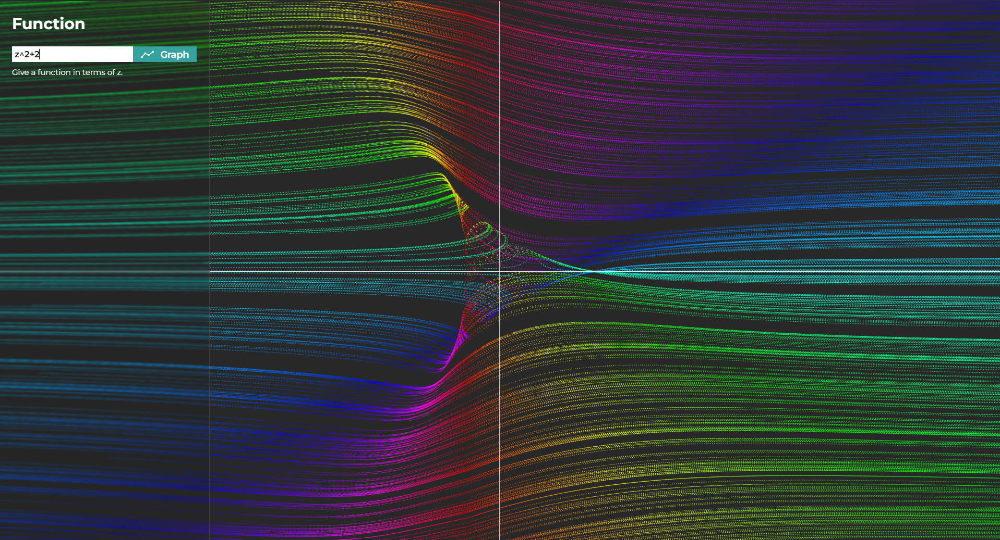

# 📊 Graphing Calculator

> Graphing and Analysis Tool for Complex Functions using ↗️ Vector Fields

The website is live at [https://vector-fields.namanarora.xyz](https://vector-fields.namanarora.xyz)



## 🍁 Features

-   Graphing Calculator for Complex valued functions
-   Vector Fields are used to represent input complex number pointing output complex number
-   To avoid clutter, we make all vector lengths equal
-   To represent the missing information about the length we use domain coloring
-   In Polya vector field we plot it's conjugate instead of the given function
-   Polya vector field represents Physical Flow
-   It represents a is Inviscid, Incompressible, Irrotational flow

## ⚙️ Technologies

-   ⚛️ React Js
-   🌈 p5.js
-   🌏 Zustand
-   🎨 Sass
-   🧊 Typescript

## 🌈 Inspiration

-   https://youtu.be/NtoIXhUgqSk?si=7oIc9fOPtutyeP-2
-   https://youtu.be/r1h3eNQ2YM0?si=KibQvlXe2b9ycDTk

## 🚶🏻‍♂️ Getting started and 🏃🏻‍♂️ Running the app

```bash
# 1. Clone the repository
$ git clone https://github.com/naman22a/graphing-calculator

# 2. Enter your newly-cloned folder.
$ cd graphing-calculator

# 3. Install client side dependencies
$ yarn install

# 4. Start the server
$ yarn dev
```

## 🤝 Contributions

Contributions, issues, and suggestions are welcome! Feel free to fork the repository and submit pull requests.

## 📫 Stay in touch

-   Author - [Naman Arora](https://namanarora.xyz)
-   Twitter - [@naman_22a](https://twitter.com/naman_22a)

## 🗒️ License

Graphing Calculator is [GPL V3](./LICENSE)
