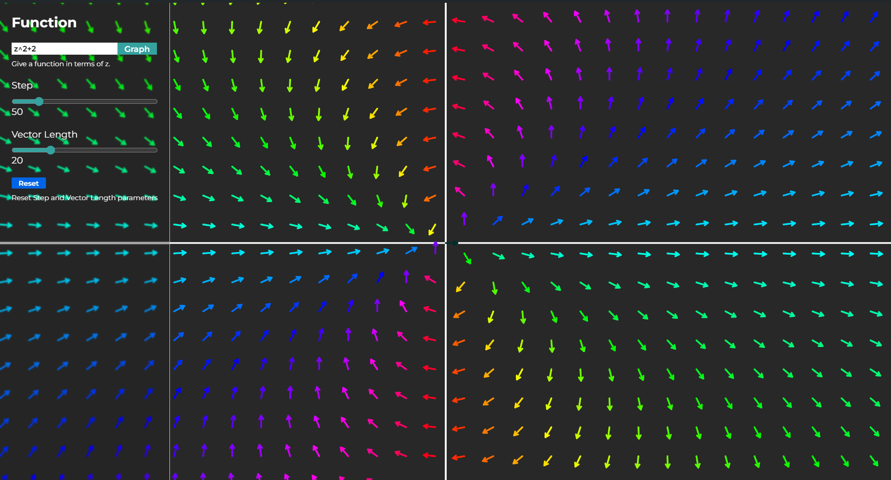

# 📊 Graphing Calculator

> Graphing and Analysis Tool for Complex Functions using ↗️ Vector Fields

## ⚙️ Technologies

-   ⚛️ React Js
-   🌈 p5.js
-   🌏 Zustand
-   🎨 Sass
-   🧊 Typescript

## 🌈 Inspiration

-   https://youtu.be/NtoIXhUgqSk?si=7oIc9fOPtutyeP-2
-   https://youtu.be/r1h3eNQ2YM0?si=KibQvlXe2b9ycDTk

## 📫 Stay in touch

-   Author - [Naman Arora](https://namanarora.vercel.app)
-   Twitter - [@namanarora1022](https://twitter.com/namanarora1022)

## 🗒️ License

Graphing Calculator is [GPL V3](./LICENSE)
